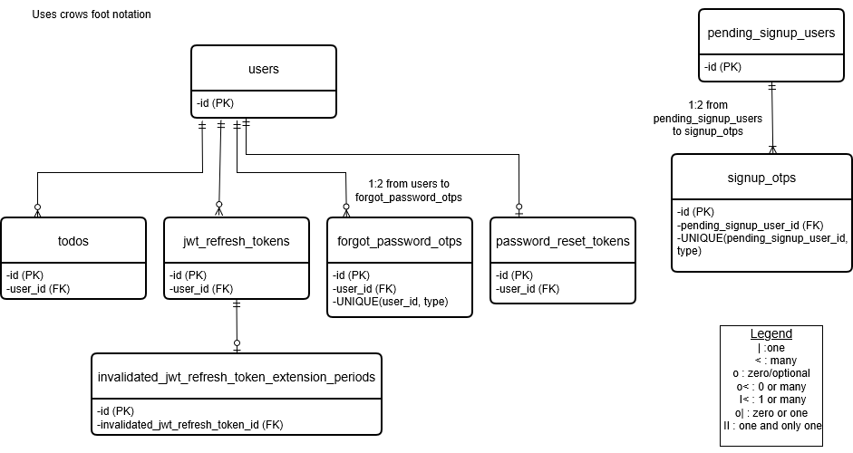

Database schema is created and managed manually in PostgreSQL 17 database server using the pgAdmin 4 GUI Query Tool.
## Database Schema Diagram

- The tables were created by executing the `CREATE TABLE` statements present within the create-tables.sql file.
- After all tables were created, indexes were created by executing the `CREATE INDEX` statements present within the create-indexes.sql file.
- db-schema.png contains the database schema diagram drawn using Crow's Foot notation.
- The database schema diagram was drawn using [drawio](https://www.drawio.com/) website. The db-schema.drawio file can be opened in [drawio](https://www.drawio.com/) website to modify or extend the diagram.
